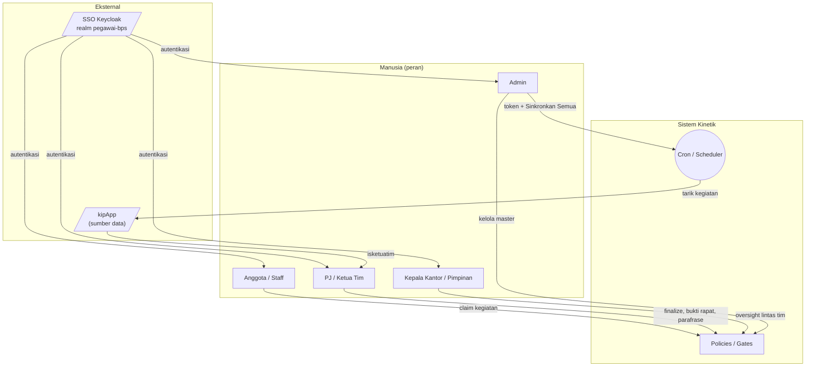

# Kinetik — Katalog Aktor (Sekarang vs Seharusnya)

| | |
|---|---|
| **Status** | Deskriptif + usulan |
| **Tanggal** | 2026-06-10 |
| **Dasar** | [[rfc-002-as-is]], [[rfc-003-to-be]], kode `app/`, [[kipapp-live-capture-2026-06-10]] |

> Mendefinisikan **setiap aktor** dalam sistem: siapa dia, apa yang **sudah**
> bisa dilakukannya hari ini (As-Is), dan apa yang **seharusnya** dimilikinya
> (To-Be). Mencakup aktor manusia, sistem, dan eksternal (kipApp).

---

## 1. Peta Aktor

---

## 2. Aktor Manusia

### 2.1 Admin
- **Siapa:** pengelola aplikasi & integrasi (mis. tim TI/MTI).
- **As-Is (kode):** role Spatie `admin` + `users.role='admin'`. Satu-satunya
  pemegang `can:manage-kip-integration` → simpan token kipApp (`storeToken`) &
  **Sinkronkan Semua** (`syncAll`). Kelola seluruh master Domain A (Tim,
  Pegawai, IKU, Projek, RK, Butir). Lihat semua dashboard.
- **To-Be (seharusnya):**
  - Kelola **lifecycle token** (lihat status kedaluwarsa, re-paste, alert).
  - Jalankan **importer master dari scrape** (Metode B, [[rfc-003-to-be]] §3).
  - Saat creds server resmi aktif: konfigurasi auth server, **tak perlu** lagi
    tempel token manual.
  - Monitoring kegagalan sync.

### 2.2 Kepala Kantor / Pimpinan (Head)
- **Siapa:** Kepala BPS Provinsi (mis. Pak Daryanto) / pejabat penilai.
- **As-Is:** role `head`; `headDashboard` — ringkasan lintas tim, daftar ketua
  projek per tim, laporan pegawai (Domain A).
- **To-Be:**
  - **Rapat Bulanan/Triwulanan**: lihat **dokumen rekap final** (snapshot),
    bukan live.
  - **Pilar B**: dashboard Kantor — ranking tim, % aktif, pemerataan beban,
    drill-down ke tim → anggota.
  - (Reserved) menilai Ketua Tim; mengedit penilaian.

### 2.3 PJ / Ketua Tim  ⭐ (aktor paling kurang terdefinisi sekarang)
- **Siapa:** penanggung jawab tim/kegiatan; yang merangkum rekap & memegang
  bukti rapat (sangat sentral di alur spreadsheet).
- **As-Is:** **bukan role formal.** Hanya tersirat dari `teams.leader_id`,
  `projects.leader_id`, atau pivot `employee_team.role='leader'`. Tidak ada
  izin khusus — siapa pun (anggota) saat ini bisa upload bukti / lihat rekap tim.
- **To-Be (seharusnya):**
  - **Diturunkan otomatis dari kipApp** `isketuatim`/`riwayatketuatim` saat sync
    → set sebagai `leader` (tak perlu input manual).
  - **Izin eksklusif** (lewat policy): **Finalize** rekap, **Promote**,
    **parafrase** (recap_overrides), **upload/hapus bukti rapat**
    (team_recap_evidences).
  - **Pilar B**: lihat beban & akuntabilitas **anggota timnya** (bukan lintas tim).
  - Default **PJ = Ketua Tim**, dengan opsi PJ tersendiri per projek (RFC-001 Q6).

### 2.4 Anggota / Staff
- **Siapa:** pegawai pelaksana kegiatan.
- **As-Is:** role `staff` (di-assign otomatis via `AssignStaffRole` saat user
  ditautkan ke employee). Bisa: **Sinkronkan** kegiatan dirinya, **claim**
  kegiatan ke RK + isi Target/Realisasi/Kendala/Solusi/RTL, tambah kegiatan
  manual, lihat rekap mingguan dirinya & rekap timnya.
- **To-Be:**
  - Lihat **ringkasan beban & akuntabilitas dirinya** (Pilar B).
  - Aturan kunci edit setelah uraian masuk Draft Mingguan PJ (RFC-001 Q2).
  - Tetap **input kegiatan di kipApp** (Kinetik tak menggantikan input harian).

---

## 3. Aktor Sistem & Eksternal

### 3.1 Cron / Scheduler
- **As-Is:** `kinetik:sync-kip-activities` **mingguan** (Senin 05:00). Memakai
  token admin tersimpan; iterasi pegawai aktif ber-`nip_lama`.
- **To-Be:** **harian**; berhenti/alert bila token mati; retry + logging;
  (kelak) pakai creds server resmi tanpa token sesi.

### 3.2 Policies / Gates (penegak izin)
- **As-Is:** `can:manage-kip-integration` (Spatie permission) untuk rute
  integrasi; policy Domain A (`PerformancePolicy`, dll). **Belum** ada policy
  PJ-only untuk finalize/bukti.
- **To-Be:** policy eksplisit untuk **PJ** (finalize/promote/evidence/override)
  dan **scope tim** untuk Pilar B.

### 3.3 kipApp (eksternal)
- **Peran:** sumber kebenaran struktur + kegiatan harian. **Tidak diubah.**
- **Peran kipApp di dalamnya** (relevan saat sync):
  - **Pegawai** (token role member) → hanya data dirinya.
  - **Admin Unit Kerja** (token role index `3`) → **semua** pegawai unit by
    `niplama` (dasar sync terpusat).
  - **Ketua Tim** (`isketuatim`) → sumber penurunan PJ.

### 3.4 SSO Keycloak (realm `pegawai-bps`)
- **As-Is:** dipakai kipApp; login Kinetik masih Non-SSO.
- **To-Be (opsional, perlu keputusan):** login Kinetik via SSO realm sama
  ([[rfc-003-to-be]] §8.8).

---

## 4. Matriks Izin (ringkas)

| Kapabilitas | Admin | Head | PJ/Ketua | Staff |
|---|:--:|:--:|:--:|:--:|
| Kelola master (Tim/IKU/Projek/RK) | ✅ | — | — | — |
| Simpan token + Sinkronkan Semua | ✅ | — | — | — |
| Sinkronkan kegiatan diri | ✅ | ✅ | ✅ | ✅ |
| Claim kegiatan → RK | — | — | ✅ | ✅ |
| **Finalize / Promote rekap** *(to-be)* | ✅ | — | ✅ | — |
| **Upload bukti rapat** *(to-be: PJ-only)* | ✅ | — | ✅ | — |
| Parafrase (overrides) | ✅ | — | ✅ | — |
| Pilar B — lihat tim sendiri *(to-be)* | ✅ | ✅ | ✅ (tim-nya) | diri sendiri |
| Pilar B — lintas tim/kantor *(to-be)* | ✅ | ✅ | — | — |

> ✅ = punya izin; — = tidak. Baris bertanda *(to-be)* belum ada di kode hari ini.

---

## 5. Kesenjangan Aktor → Backlog

1. **PJ/Ketua Tim** belum aktor formal → buat role + policy; turunkan dari
   kipApp `isketuatim`.
2. **Pilar B scope** belum ada → policy "lihat tim sendiri" vs "lintas tim".
3. **Admin token lifecycle** belum ada UI/alert.
4. **SSO** belum diputuskan untuk login Kinetik.
