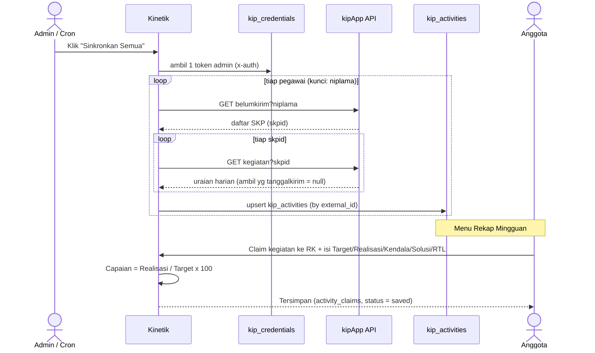
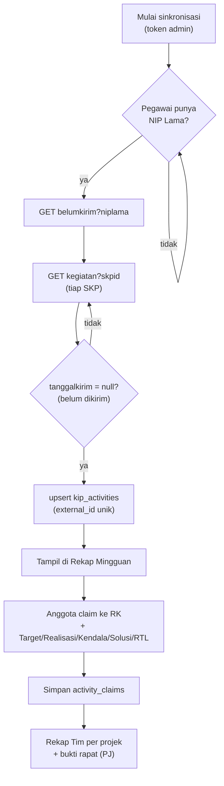

# Sub-Diagram: Fungsi Inti Integrasi kipApp

> Zoom-in ke bagian terpenting: **bagaimana data kipApp masuk ke Kinetik lalu
> menjadi rekap**. Lengkapi ERD utama (`erd-kinetik.dbml`).

---

## 1. Sequence Diagram — Sinkronisasi & Claim

**Inti yang ditunjukkan:**
- Cukup **1 token admin** untuk menarik **semua** pegawai (kunci = `niplama`).
- Tarikan **2 langkah**: `belumkirim` → `kegiatan?skpid`.
- Data mentah masuk ke `kip_activities`; setelah di-claim jadi `activity_claims`.

---

## 2. Flowchart — Alur Tarik & Claim

---

## 3. Pemetaan Field: kipApp → Kinetik

| Dari kipApp (`kegiatan`) | Kolom Kinetik | Catatan |
|---|---|---|
| `kegiatanperhariid` | `kip_activities.external_id` | kunci idempotent |
| `kegiatan` | `description` | uraian |
| `tanggal` / `tanggalselesai` | `activity_date_start/end` | |
| `jammulai` / `jamselesai` | `time_start/end` | opsi jam |
| `datadukung` | `evidence_url` | link bukti |
| `rkid` / `rencanakinerja` | `rk_external_id` / `rk_name` | tautan RK |
| `progres` (0–100) | `progress` | |
| `capaian` (teks) | `achievement_note` | |
| `tanggalkirim` | `sent_at` | null = belum kirim |
| **Target / Realisasi** | `activity_claims.target/realization` | **tidak ada di kipApp → manual** |

> Struktur (Tim/Projek/Anggota Projek) juga bisa ditarik: `timkerja/anggota`,
> `proyek?timkerjaid`, `proyek/anggota?proyekid`.
