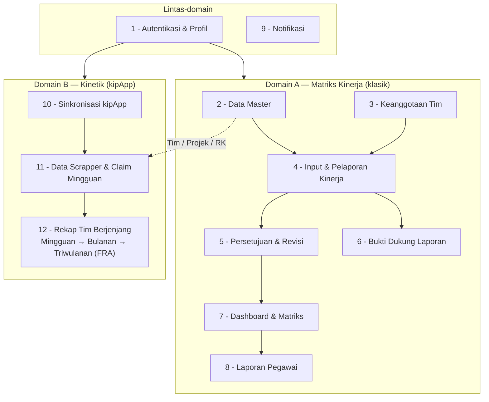

# Peta Proses Bisnis — Aplikasi Matriks Kinerja & Kinetik

> Daftar proses bisnis yang berjalan di aplikasi, dikelompokkan ke **2 domain**:
> **Matriks Kinerja** (penilaian kinerja klasik berbasis laporan bulanan) dan
> **Kinetik** (integrasi kipApp berbasis kegiatan harian).

## Ringkasan

- **12 proses bisnis aktif** = **9** (Matriks Kinerja) + **3** (Kinetik).
- **6 fitur reserved** (roadmap, Probis item 12).
- Total **18** bila reserved ikut dihitung.

> Angka bergantung granularitas: bila Data Master dipecah per-entitas, atau Rekap
> Berjenjang dihitung 3 tingkat, jumlahnya bertambah (mis. jadi 14 aktif).

---

## Peta Proses

---

## Domain A — Matriks Kinerja (klasik) — 9 proses

| # | Proses Bisnis | Aktor utama | Controller |
|---|---|---|---|
| 1 | **Autentikasi & Profil** (login SSO/Non-SSO, peran admin/head/staff, profil + NIP) | semua | `Auth`, `ProfileController` |
| 2 | **Manajemen Data Master** (Tim, Pegawai +mutasi +pendidikan, IKU, Projek, RK, Butir Kerja) | admin | `Team/Employee/PerformanceIndicator/Project/PerformancePlan/WorkItem` |
| 3 | **Manajemen Keanggotaan Tim** (many-to-many) | admin | `TeamMemberController` |
| 4 | **Input & Pelaporan Kinerja** (staff isi realisasi per butir kerja) | staff | `ProjectList/ProjectDetail/WorkItemDetail/Performance` |
| 5 | **Persetujuan & Revisi Laporan** (ketua/pimpinan approve/reject, staff resubmit) | ketua/pimpinan | `PerformanceApproval/ReportResubmit` |
| 6 | **Bukti Dukung Laporan** (lampiran + review) | staff/ketua | `ReportAttachmentController` |
| 7 | **Dashboard & Matriks Kinerja** (role-aware + matriks penugasan/capaian) | semua | `DashboardController` |
| 8 | **Laporan Pegawai** | pimpinan/admin | `EmployeeReportController` |
| 9 | **Notifikasi** | semua | `NotificationController` |

## Domain B — Kinetik (integrasi kipApp) — 3 proses

| # | Proses Bisnis | Aktor | Controller | Probis |
|---|---|---|---|---|
| 10 | **Sinkronisasi Data kipApp** (1 token admin tarik semua pegawai) | admin/cron | `KipIntegrationController` | item 5 |
| 11 | **Data Scrapper & Claim Mingguan** (claim kegiatan → RK + Target/Realisasi/Kendala/Solusi/RTL → simpan) | anggota | `WeeklyActivityController` | item 6–8 |
| 12 | **Rekap Tim Berjenjang** — Mingguan (+bukti rapat: Notula/Foto/DH) → Bulanan (parafrase) → Triwulanan (FRA + tindak lanjut/PIC/batas waktu) | anggota/PJ/pimpinan | `TeamRecapController` | item 9–11 |

> Probis item 1–4 sudah tercakup di proses #1–#3. Probis item 12 = fitur reserved (di bawah).

---

## Reserved Features (roadmap, belum dibangun) — Probis item 12

| Kode | Fitur |
|---|---|
| RF-1 | Penilaian kinerja (ketua menilai anggota; pimpinan menilai ketua; pimpinan edit semua) |
| RF-2 | Penilaian kinerja Kepala Kabupaten/Kota |
| RF-3 | Analisis beban kerja pegawai |
| RF-4 | Best Employee (AI Generated) |
| RF-5 | Angka Kredit Konversi dari SKP |
| RF-6 | Estimasi Naik Pangkat |

Detail & implikasi data: lihat `rfc-001-rekap-kipapp.md` §11.
