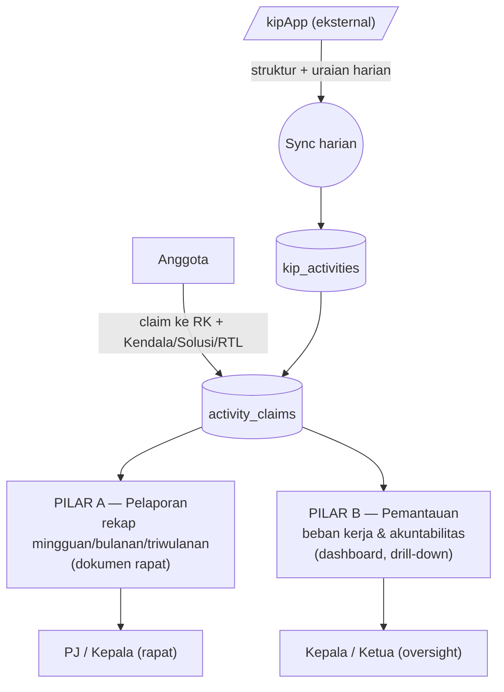
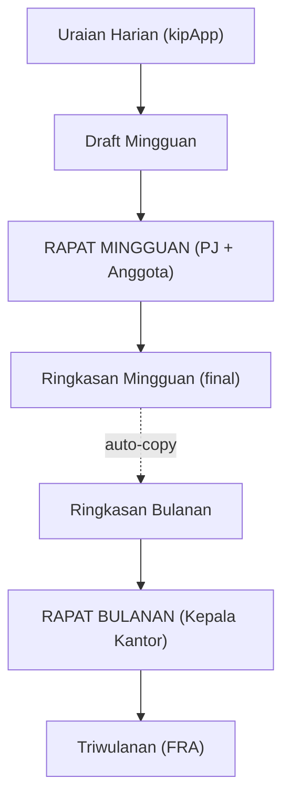
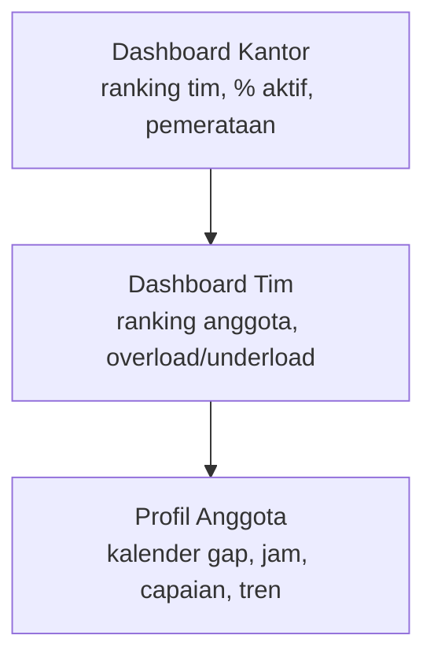
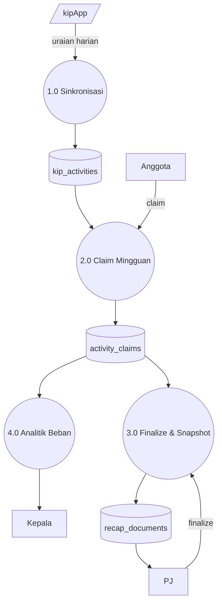
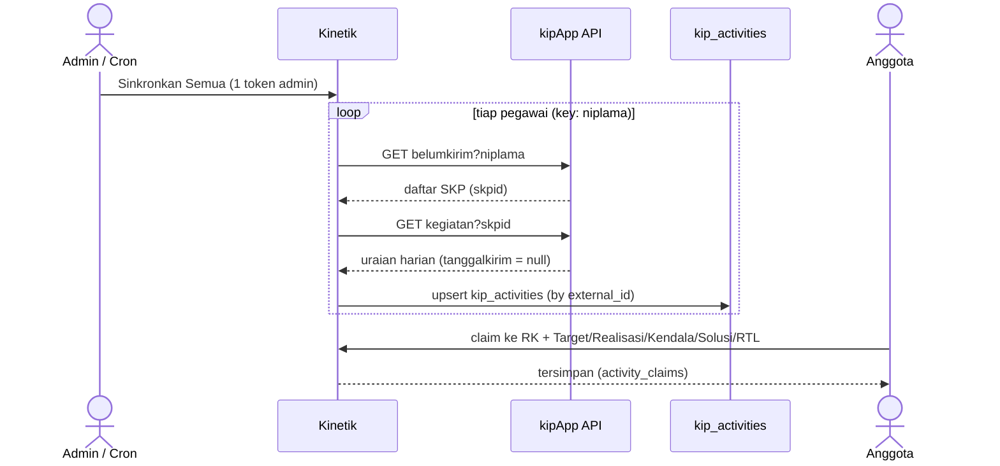

# RFC-001: Kinetik — Integrasi kipApp, Pelaporan & Pemantauan Kinerja

| | |
|---|---|
| **Status** | Draft (bahan diskusi — belum dibahas dengan Pimpinan) |
| **Penulis** | Tim Kinetik |
| **Tanggal** | 2026-06-09 |

> Dokumen ini sengaja dibuat sebagai **usulan konkret untuk memulai diskusi**,
> bukan spesifikasi final. Tujuannya memberi Pimpinan gambaran utuh agar mudah
> dikoreksi/disepakati.

---

## 1. Summary

**Kinetik** mengintegrasikan data **kipApp** (Tim, Projek, Anggota, Uraian Harian)
lalu menyediakan **dua pilar** di atas data yang sama:

- **Pilar A — Pelaporan:** rekap mingguan → bulanan → triwulanan (FRA) sebagai
  **dokumen rapat** (Rapat Mingguan dengan PJ, Rapat Bulanan dengan Kepala Kantor).
- **Pilar B — Pemantauan:** **beban kerja & akuntabilitas** — menjawab pertanyaan
  Kepala: *"apakah pegawai benar-benar bekerja?"* dan *"siapa yang beban kerjanya
  lebih berat/ringan?"*. Mirip Jira/Linear, **tapi bukan untuk menugaskan task** —
  kipApp tetap tempat input kegiatan.

Keduanya membaca sumber yang sama: kegiatan harian kipApp yang di-sync dan di-claim
ke RK (`activity_claims`).

---

## 1a. Poin yang Perlu Diputuskan Pimpinan

Ringkasan keputusan yang menentukan arah (detail di §8 & §11).

**Tentang Pemantauan (Pilar B — kebutuhan inti):**
1. **Seberapa jauh?** cukup **analitik/pemantauan** (usulan), atau sampai
   **penugasan task** ala Jira (fase lanjut)?
2. **Definisi "bekerja"** — sinyal & **ambang**nya (Coverage, gap day, jam,
   capaian, recency)?
3. **Definisi "beban kerja"** — dimensi & bobot; terutama **bobot kompleksitas**
   sumbernya dari mana?
4. **Hari kerja** — memperhitungkan libur/cuti agar cuti tak dihitung sebagai gap?
5. Pimpinan ingin hanya **melihat**, atau juga **menindak** (menyeimbangkan beban)?

**Tentang Pelaporan (Pilar A):**
6. **PJ** = Ketua Tim atau PJ-per-projek?
7. Rekap mingguan **di-finalize** sebelum atau **saat** Rapat Mingguan?
8. **Bukti rapat** (Notula/Dokumentasi/Daftar Hadir): hanya **PJ** yang upload?
   wajib sebelum finalize? ikut terbawa ke bulanan?
9. **Target/Realisasi**: di kipApp target hanya **teks di IKI** (mis. "Sebanyak 4
   dokumen"), realisasi = `progres` (%). Untuk angka per kegiatan: **parse dari
   teks IKI**, isi **manual**, atau default dari **target RK**?

---

## 2. Problem Statement

- Kepala butuh **visibilitas pemantauan**: siapa aktif/tidak; beban kerja merata
  atau timpang. Ini **kebutuhan utama** dan belum terjawab.
- Alur kerja pelaporan bersifat **dokumen rapat** (draft → finalize saat rapat →
  salin ke bulanan), sementara aplikasi sekarang menghitung rekap **live**
  (belum ada snapshot final untuk dokumen rapat).
- Data kipApp (struktur tim/projek/anggota + uraian harian) perlu **masuk rapi**
  dan ter-claim ke RK — fondasi untuk kedua pilar.

---

## 3. Goals & Non-Goals

**Goals**
- Sync struktur + uraian harian kipApp (harian/mingguan), enrich Kendala/Solusi/RTL.
- **Pilar A:** rekap berjenjang selaras alur dokumen rapat (draft → finalize → promote).
- **Pilar B:** indikator akuntabilitas + indeks beban kerja yang **bisa dibandingkan**
  (drill-down kantor → tim → anggota).

**Non-Goals**
- **Penugasan task** & papan status ala Jira penuh (bisa jadi fase lanjut bila diminta).
- Penilaian/scoring SDM formal & fitur reserved lain (§14).
- Mengubah cara kerja kipApp.
- **SSO** realm `pegawai-bps` (trek terpisah, kecuali disepakati digabung).

---

## 4. Terminology

| Istilah | Arti |
|---|---|
| **Tim PJK** | Tim Penanggung Jawab Kegiatan (unit/tim kerja) |
| **PJ** | Penanggung Jawab — **default Ketua Tim**, tapi bisa PJ tersendiri |
| **Anggota Projek** | penugasan anggota ke projek tertentu |
| **Uraian Harian** | kegiatan harian anggota di kipApp (key: NIP Lama / niplama) |
| **Draft / Ringkasan Mingguan** | bahan Rapat Mingguan / versi final (snapshot) |
| **Promote** | salin snapshot periode bawah → dokumen periode atas |
| **FRA** | format laporan triwulanan |
| **Bukti Rapat** | Notula, Dokumentasi (foto), Daftar Hadir — di-upload **PJ** |
| **Coverage / Gap day** | rasio hari kerja yang ada kegiatannya / hari kerja tanpa kegiatan |
| **Indeks Beban Kerja** | skor gabungan untuk membandingkan beban antar pegawai |

---

## 5. Current State

### 5.1 Status Probis Kinetik (item 1–11)

| # | Probis | Status |
|---|---|---|
| 1 | Master IKU, Tim, Project, RK (1→M, cascading) | ✅ ada |
| 2 | Master Tim & Anggota (M↔N) | ✅ ada |
| 3 | Pegawai input capaian harian di kipApp | ⚪ eksternal |
| 4 | Login Kinetik (SSO / Non-SSO) | 🟡 Non-SSO ✅; SSO belum |
| 5 | Automate/Execute ekstrak kipApp | ✅ cron + tombol + 1 token admin terpusat |
| 6 | Data Scrapper: claim ke RK + field + jam + reserved var | ✅ |
| 7–8 | Claim → Simpan; rekap mingguan tersimpan | ✅ |
| 9 | Rekap tim mingguan, segmentasi per project, + evidence | ✅ |
| 10–11 | Rekap bulanan (parafrase) & triwulanan (FRA) | ✅ |

### 5.2 Data yang tersedia dari kipApp

| Data | Endpoint | Status |
|---|---|---|
| Tim / Projek / Anggota tim | `unitkerja`, `timkerja`, `timkerja/anggota` | ✅ **ditarik otomatis dari kipApp** (jangan input manual — bisa beda dgn kipApp) |
| **Anggota projek** (penugasan anggota ke projek) | `proyek/anggota?proyekid=` | ✅ **tersedia di kipApp** → ditarik otomatis |
| Anggota **lintas tim** (1 pegawai di >1 tim) | — | ✅ **didukung** (model M↔N `employee_team`) |
| Uraian harian | `kegiatan?skpid=` per `niplama` (2 langkah) | ✅ |
| **Target** | ADA — di **IKI** (`/v1/skp/iki?skpid=&rkid=`), tapi **ditulis inline di teks indikator** (mis. "Sebanyak 4 dokumen", "sebesar 100 persen"), **bukan** field angka terpisah | bisa di-parse dari teks IKI, atau isi manual |
| **Realisasi / Capaian** | `progres` (0–100%) + `capaian` (teks) di daily kegiatan | `progres` = realisasi %; tidak ada angka realisasi terstruktur |

> 1 token **admin** menarik data **semua** anggota by `niplama` (terbukti).
>
> ⚠️ **Catatan kualitas data:** isian `capaian` pegawai sekarang sering **asal
> (100% semua)**. Artinya `capaian`/`progres` adalah sinyal yang **lemah** untuk
> akuntabilitas (Pilar B) — perlu hati-hati saat dijadikan ukuran.
>
> ⚠️ **Catatan akses API:** endpoint di atas **ditemukan sendiri** dari inspeksi
> kipApp (belum diberikan resmi oleh pusat). Perlu dibahas dgn Pak Hespri agar
> dapat akses/dokumentasi resmi — supaya integrasi tidak rapuh kalau API berubah.

### 5a. Keputusan Desain (asumsi awal)

Keputusan yang dipakai sebagai dasar RFC ini:

| Topik | Keputusan |
|---|---|
| Struktur: Tim, Projek, Anggota Tim, **Anggota Projek** | **Ditarik otomatis dari kipApp** (jangan input manual — bisa beda dgn kipApp) |
| Anggota di **>1 tim** | **Didukung** (lintas tim) |
| Frekuensi sinkronisasi | **Harian** |
| **PJ** (Penanggung Jawab) | **Default Ketua Tim**, tapi bisa PJ tersendiri |
| Input saat claim | **Link data dukung WAJIB**; **jam mulai/selesai opsional** |
| **Target** | ada di kipApp tapi sebagai **teks di indikator (IKI)** — bukan angka terpisah; per kegiatan diisi saat claim (parse dari IKI atau manual) |
| **Realisasi** | dari `progres` (0–100%) daily kegiatan + `capaian` (teks) |
| **Rekap mingguan tim** | disusun **per projek** (segmentasi) |
| **Ringkasan Bulanan** | **Diparafrase** oleh PJ untuk Rapat Bulanan |

---

## 6. Architecture Overview (gambaran utuh)



---

## 6a. Sinkronisasi & Integrasi kipApp (fondasi)

**Yang ditarik OTOMATIS dari kipApp** (jangan diinput manual — bisa beda dgn kipApp):
- Struktur: **Tim, Projek, Anggota Tim, Anggota Projek** (`proyek/anggota`).
- **Uraian harian** per pegawai (2 langkah: `belumkirim` → `kegiatan?skpid`).

**Frekuensi:** **harian**.

**Pemicu sinkronisasi — Admin (manual) vs Cron (otomatis):**

| | **Admin / manual** (tombol "Sinkronkan") | **Cron / otomatis** (terjadwal) |
|---|---|---|
| **Pro** | terkontrol — admin tahu persis kapan ditarik; tak perlu token auto-refresh (admin login → ambil token → tarik) | data selalu terkini tanpa campur tangan; cocok untuk pemantauan harian; tak bergantung kerajinan admin |
| **Kontra** | bergantung kedisiplinan admin; data bisa telat; rutinitas manual tiap hari | butuh token valid terus — token kipApp ~24 jam; kalau mati, sync **gagal diam-diam** → perlu **kredensial server resmi / refresh otomatis** + monitoring kegagalan |

**Usulan:** karena sync **harian**, **cron** paling pas — **tapi** bergantung
solusi token (kredensial server resmi atau mekanisme refresh). Selama token resmi
belum ada, pakai **admin-manual sebagai jembatan**, lalu pindah ke cron penuh.

> ⚠️ Endpoint API di RFC ini **ditemukan dari inspeksi** kipApp (belum diberikan
> resmi oleh pusat). Bahan diskusi dgn **Pak Hespri**: minta akses/dokumentasi
> API resmi + solusi token, agar cron bisa jalan tanpa putus. Contoh respons tiap
> endpoint ada di **§16**.

---

## 7. Pilar A — Pelaporan (Reporting)

### 7.1 Alur dokumen ↔ rapat



### 7.2 Model rekap — Hybrid (live + snapshot + promote)
- Sebelum final → rekap **live** (boleh berubah & diparafrase via `recap_overrides`).
- **Finalize** (oleh PJ) → snapshot agregasi + parafrase ke `recap_documents`
  (status `final`).
- **Promote** → snapshot mingguan ditambahkan ke dokumen bulanan; **PJ
  memparafrase Ringkasan Bulanan** (rangkuman antar minggu) untuk Rapat Bulanan;
  lalu bulanan → triwulanan.
- **Buka lagi** untuk koreksi → finalize ulang.

> Alternatif yang dipertimbangkan: *Live-only* (sekarang; tak ada versi final
> untuk rapat) dan *Snapshot-only* (duplikatif, bisa basi). **Hybrid** dipilih
> karena dapat keduanya. Tabel baru: `recap_documents`. Actions:
> `FinalizeRecapAction`, `PromoteRecapAction`.

### 7.3 Bukti Rapat (di-upload PJ)
Notula / Dokumentasi (foto) / Daftar Hadir → `team_recap_evidences`
(`type = notula|photo|attendance`). **Sudah ada**; perubahan kecil: batasi upload
hanya untuk **PJ**.

---

## 8. Pilar B — Pemantauan (Workload & Accountability)

kipApp tetap tempat input; Kinetik = sync + enrich + **analitik**. (Penugasan task
ala Jira = kemungkinan **fase lanjut**, lihat Poin Diskusi #1.)

### 8.1 Drill-down



### 8.2 Metrik Akuntabilitas — "apakah bekerja?"

| Metrik | Sumber | Guna |
|---|---|---|
| **Coverage** | hari ada kegiatan ÷ hari kerja | keteraturan |
| **Gap days** | hari kerja tanpa kegiatan | deteksi "menghilang" |
| **Volume** | jumlah kegiatan | aktivitas |
| **Jam kerja** | Σ (jam selesai − jam mulai) | beban waktu |
| **Capaian** | rata-rata % capaian | hasil |
| **Recency** *(usulan)* | tanggal kegiatan terakhir | "basi" kalau > N hari |
| **Ketepatan kirim** *(usulan)* | `tanggal` vs `tanggalkirim`; deteksi input **dirapel** | disiplin |
| **Kelengkapan** *(usulan)* | % ada bukti dukung; % sudah di-claim | kualitas data |

> **Status pegawai** (usulan): `Aktif` / `Perlu Perhatian` / `Tidak Aktif`
> berdasarkan ambang yang dapat dikonfigurasi.

### 8.3 Indeks Beban Kerja

```
Beban = w1·norm(jumlah_kegiatan) + w2·norm(total_jam)
      + w3·norm(jumlah_projek_RK) + w4·norm(Σ bobot_kompleksitas)
```

- `norm` = normalisasi ke **rata-rata tim/kantor** → **indeks 100 = rata-rata**;
  `>120` overload, `<80` underload (ambang diatur).
- **Bobot kompleksitas** sumbernya perlu disepakati (manual per RK / per jabatan /
  default 1) — lihat Open Questions.
- *(Usulan)* tampilkan **pemerataan** (std-dev beban dalam 1 tim) untuk Ketua.

---

## 9. Data Model

Sebagian besar **dipakai ulang** (`activity_claims`, `kip_activities`,
`recap_overrides`, `team_recap_evidences`). Yang baru/diubah:

| Tabel/kolom | Untuk | Catatan |
|---|---|---|
| `recap_documents` (baru) | Pilar A | snapshot + promote (`status`, `snapshot`, `parent_document_id`) |
| `project_members` (sudah ada) | fondasi | di-sync dari kipApp `proyek/anggota` |
| `performance_plans.complexity_weight` (baru, opsional) | Pilar B | bobot kompleksitas; default 1 |
| `workload_snapshots` (baru, opsional) | Pilar B | cache metrik per pegawai/periode untuk performa & tren |

ERD lengkap (DBML) ada di **§15**.

---

## 10. Diagram Pendukung (DFD & Sequence)

**DFD Level 1**



**Sequence — Sync kipApp & Claim**



---

## 11. Open Questions (masih perlu dibahas)

> Keputusan yang sudah ditetapkan ada di **§5a**. Berikut yang masih perlu dibahas.

### Pelaporan (Pilar A)

1. **Kapan** Draft Mingguan di-finalize menjadi Ringkasan Mingguan — oleh PJ
   **sebelum** Rapat Mingguan, atau dibahas & difinalkan **saat** rapat berlangsung?
2. Setelah uraian anggota tersalin ke Draft Mingguan PJ, apakah anggota **masih
   boleh mengubah** uraiannya, atau draft **terkunci** untuk PJ?
3. Penyalinan (**promote**) Ringkasan Mingguan → Bulanan: **otomatis**, atau perlu
   **persetujuan** PJ/Pimpinan dulu?
4. Bukti rapat (Notula, Dokumentasi, Daftar Hadir): apakah **hanya PJ** yang boleh
   meng-upload, atau anggota juga?
5. Apakah ketiga bukti rapat **wajib** sebelum Ringkasan Mingguan bisa di-finalize?
6. Apakah bukti rapat **ikut terbawa** ke Ringkasan Bulanan, atau cukup di mingguan?

### Pemantauan (Pilar B)

7. Seberapa jauh fungsi pemantauannya — cukup **analitik/dashboard**, atau sampai
   bisa **menugaskan task** & papan status seperti Jira?
8. Sinyal apa saja untuk menilai **"pegawai benar-benar bekerja"** (keteraturan/
   gap hari, jumlah kegiatan, jam kerja, capaian, kebaruan input)?
9. Berapa **ambang batas** tiap sinyal untuk status **Aktif / Perlu Perhatian /
   Tidak Aktif** (mis. coverage di bawah berapa %? tidak input berapa hari)?
10. **"Beban kerja"** dari dimensi apa (jumlah kegiatan, total jam, jumlah
    projek/RK, bobot kompleksitas) + **bobot** tiap dimensi?
11. **Bobot kompleksitas** sumbernya dari mana — manual per RK, per jabatan, dari
    target RK, atau diseragamkan dulu (bobot = 1)?
12. Apakah **"hari kerja"** memperhitungkan **libur nasional & cuti** (agar cuti
    tak dihitung gap)?

### Integrasi / Operasional

13. **Pemicu sinkronisasi** — Admin-manual atau Cron-otomatis? (pro/kontra di §6a).
    Kalau cron: **solusi token** (token kipApp ~24 jam) — kredensial server resmi
    atau refresh otomatis?
14. **Verifikasi ke Pak Hespri:** konfirmasi target di kipApp memang **teks di IKI**
    (bukan angka), dan minta **akses/dokumentasi API resmi** (endpoint sekarang
    hasil inspeksi).

---

## 12. Rollout Plan

| Tahap | Pelaporan (A) | Pemantauan (B) |
|---|---|---|
| **MVP** | Finalize + snapshot **mingguan** | Dashboard **Tim**: indeks beban (kegiatan+jam+projek) + coverage + status aktif/tidak |
| **Tahap 2** | Promote mingguan→bulanan + UI Rapat Bulanan | Dashboard **Kantor** + pemerataan + tren |
| **Tahap 3** | Triwulanan (FRA) + persetujuan antar tingkat | Bobot kompleksitas + ketepatan kirim + sinkron harian |

---

## 13. Access & Permissions

- **Anggota** — input/claim; lihat ringkasan tim & ringkasan dirinya.
- **PJ / Ketua Tim** — finalize, parafrase, kelola bukti; lihat beban & akuntabilitas **anggota timnya**.
- **Kepala Kantor / Pimpinan** — lihat ringkasan bulanan/triwulanan + **semua tim** (drill-down).

---

## 14. Future Work — Reserved Features (Probis Item 12)

| Kode | Fitur | Catatan |
|---|---|---|
| RF-1 | Penilaian kinerja (ketua→anggota, pimpinan→ketua) | tabel `assessments`; bertumpu rekap bulanan |
| RF-2 | Penilaian Kepala Kab/Kota | `employees.office` |
| ~~RF-3~~ | ~~Analisis beban kerja~~ | **→ dipromosikan jadi Pilar B (inti)** |
| RF-4 | Best Employee (AI) | ringkasan/ranking via Claude API |
| RF-5 | Angka Kredit dari SKP | tabel aturan konversi per jabatan |
| RF-6 | Estimasi Naik Pangkat | dari akumulasi angka kredit |

---

## 15. ERD Lengkap (DBML)

Skema lengkap dalam format DBML — tempel ke <https://dbdiagram.io> untuk render visual.

```dbml
Project kinetik {
  database_type: 'PostgreSQL (prod) / SQLite (lokal & CI)'
  Note: 'Master IKU/Tim/Project/RK + sync kipApp + rekap + pemantauan beban kerja'
}

// ---------- MASTER ----------
Table users {
  id bigint [pk]
  name varchar
  email varchar [unique]
  role varchar [note: 'admin | head | staff']
}

Table teams {
  id bigint [pk]
  name varchar
  code varchar
  description text [null]
  is_active boolean
  leader_id bigint [ref: > employees.id, null, note: 'ketua tim']
}

Table employees {
  id bigint [pk]
  user_id bigint [ref: > users.id, null]
  team_id bigint [ref: > teams.id, null, note: 'tim utama (home team)']
  name varchar
  full_name varchar [null]
  employee_number varchar [null]
  nip_lama varchar [unique, null, note: 'NIP lama 9 digit — key kipApp (niplama)']
  nip_baru varchar [unique, null, note: 'NIP baru 18 digit']
  position varchar [null]
  office varchar [null, note: 'diisi untuk Kepala Satker kabupaten/kota']
  display_name varchar [null]
  is_active boolean
}

Table employee_team {
  id bigint [pk]
  employee_id bigint [ref: > employees.id]
  team_id bigint [ref: > teams.id]
  role varchar [note: 'member | leader']
  is_primary boolean [note: 'true kalau ini tim utama pegawai']
  started_at date [null]
  ended_at date [null]
  Indexes { (employee_id, team_id) [unique] }
}

Table performance_indicators {
  id bigint [pk]
  team_id bigint [ref: > teams.id]
  year integer
  code varchar [null]
  name varchar [note: 'nama IKU']
  target decimal [null]
  target_unit varchar [null]
  description text [null]
}

Table projects {
  id bigint [pk]
  team_id bigint [ref: > teams.id]
  performance_indicator_id bigint [ref: > performance_indicators.id, null]
  leader_id bigint [ref: > employees.id, null]
  name varchar [note: 'Program Kerja / Projek']
  description text [null]
  objective text [null]
  kpi text [null]
  status varchar [note: 'active | completed | cancelled']
  year integer
}

Table project_members {
  id bigint [pk]
  project_id bigint [ref: > projects.id]
  employee_id bigint [ref: > employees.id]
  role varchar [note: 'peran di projek; bisa di-sync dari kipApp (proyek/anggota)']
}

Table performance_plans {
  id bigint [pk]
  project_id bigint [ref: > projects.id]
  code varchar [null]
  description text [note: 'uraian Rencana Kinerja (RK)']
  target decimal [null, note: 'target RK']
  target_unit varchar [null]
  period_type varchar [note: 'year | quarter | month']
  period smallint [null]
  pic_employee_id bigint [ref: > employees.id, null]
  complexity_weight decimal [null, note: 'USULAN (Pilar B): bobot kompleksitas; default 1']
}

Table work_items {
  id bigint [pk]
  project_id bigint [ref: > projects.id]
  performance_plan_id bigint [ref: > performance_plans.id, null]
  number integer
  description text [note: 'Butir Kerja']
  target decimal [null]
  target_unit varchar [null]
}

// ---------- SYNC kipApp ----------
Table kip_credentials {
  id bigint [pk]
  token text [note: 'token x-auth (encrypted) — 1 token admin untuk sync semua pegawai']
  account_nip varchar [null]
  account_name varchar [null]
  expires_at datetime [null, note: 'masa berlaku token kipApp (~24 jam)']
  updated_by bigint [ref: > users.id, null]
}

Table kip_activities {
  id bigint [pk]
  employee_id bigint [ref: > employees.id]
  external_id varchar [unique, note: 'kegiatanperhariid — biar upsert idempotent']
  nip_lama varchar [note: 'niplama']
  description text [note: 'uraian kegiatan']
  activity_date_start date
  activity_date_end date [null]
  time_start time [null]
  time_end time [null]
  evidence_url varchar [null, note: 'datadukung']
  rk_external_id varchar [null, note: 'rkid']
  rk_name varchar [null, note: 'rencanakinerja']
  progress integer [null, note: 'progres 0-100']
  achievement_note text [null, note: 'capaian (teks)']
  period_id bigint [null]
  source_year integer [null]
  sent_at datetime [null, note: 'tanggalkirim; null = belum dikirim']
  is_claimed boolean
  raw_payload json [null]
  fetched_at datetime [null]
  reserved_1 varchar [null]
  reserved_2 varchar [null]
  reserved_3 varchar [null]
}

// ---------- REKAP (Pilar A) ----------
Table activity_claims {
  id bigint [pk]
  kip_activity_id bigint [ref: > kip_activities.id, null]
  employee_id bigint [ref: > employees.id]
  performance_plan_id bigint [ref: > performance_plans.id, note: 'di-claim ke RK ini']
  work_item_id bigint [ref: > work_items.id, null]
  target decimal [null, note: 'angka — di kipApp hanya teks di IKI; parse/manual']
  realization decimal [null, note: 'manual']
  achievement decimal [null, note: 'capaian (%) = realisasi / target x 100']
  target_unit varchar [null]
  obstacle text [null, note: 'kendala']
  solution text [null, note: 'solusi']
  follow_up_plan text [null, note: 'rencana tindak lanjut']
  activity_date_start date
  activity_date_end date [null]
  start_time time [null]
  end_time time [null]
  evidence_url varchar [null]
  status varchar [note: 'draft | saved']
  week_start date
  period_year integer
  period_quarter smallint
  period_month smallint
  reserved_1 varchar [null]
  reserved_2 varchar [null]
  reserved_3 varchar [null]
  claimed_at datetime [null]
  Indexes {
    (employee_id, week_start)
    (period_year, period_quarter)
    (period_year, period_month)
  }
}

Table team_recap_evidences {
  id bigint [pk]
  team_id bigint [ref: > teams.id]
  project_id bigint [ref: > projects.id, null, note: 'segmen projek']
  period_type varchar [note: 'week | month | quarter']
  period_year integer
  week_start date [null]
  period_quarter smallint [null]
  period_month smallint [null]
  type varchar [note: 'notula | photo (Dokumentasi) | attendance (Daftar Hadir)']
  title varchar [null]
  url varchar [note: 'link bukti']
  uploaded_by bigint [ref: > employees.id, null, note: 'PJ']
}

Table recap_overrides {
  id bigint [pk]
  team_id bigint [ref: > teams.id]
  performance_plan_id bigint [ref: > performance_plans.id, note: 'baris RK yang diparafrase']
  period_type varchar [note: 'month | quarter']
  period_year integer
  period_quarter smallint [null]
  period_month smallint [null]
  obstacle text [null, note: 'parafrase kendala']
  solution text [null, note: 'parafrase solusi']
  follow_up_plan text [null, note: 'parafrase tindak lanjut']
  follow_up_evidence_url varchar [null, note: 'FRA: link bukti tindak lanjut']
  follow_up_pic_employee_id bigint [ref: > employees.id, null, note: 'FRA: PIC']
  follow_up_deadline date [null, note: 'FRA: batas waktu']
  created_by bigint [ref: > employees.id, null]
}

// Usulan RFC (Pilar A) — dokumen rekap final + promote
Table recap_documents {
  id bigint [pk]
  team_id bigint [ref: > teams.id]
  period_type varchar [note: 'week | month | quarter']
  period_year integer
  week_start date [null]
  period_quarter smallint [null]
  period_month smallint [null]
  status varchar [note: 'draft | final']
  snapshot json [null, note: 'snapshot agregasi saat di-finalize']
  finalized_at datetime [null]
  finalized_by bigint [ref: > employees.id, null, note: 'PJ']
  parent_document_id bigint [ref: > recap_documents.id, null, note: 'promote: minggu -> bulan -> triwulan']
  Note: 'Usulan — dokumen final untuk rapat'
}

// Usulan RFC (Pilar B) — cache metrik beban kerja
Table workload_snapshots {
  id bigint [pk]
  employee_id bigint [ref: > employees.id]
  period_type varchar [note: 'week | month']
  period_year integer
  period_month smallint [null]
  week_start date [null]
  activity_count integer [null]
  total_hours decimal [null]
  project_count integer [null]
  coverage decimal [null, note: 'rasio hari ada kegiatan']
  avg_achievement decimal [null]
  workload_index decimal [null, note: 'indeks beban (100 = rata-rata)']
  last_activity_date date [null]
  computed_at datetime [null]
  Note: 'Usulan (opsional) — cache untuk performa & tren'
}
```

---

## 16. Temuan API kipApp (Referensi & Contoh Respons)

> Endpoint hasil **inspeksi** kipApp (bahan untuk Pak Hespri — minta versi resmi).
> Base: `https://kipapp.bps.go.id/api/v1`. Auth: header `x-auth: Bearer <JWT>`.
> Nilai contoh adalah **sampel nyata** (dipotong seperlunya).

### 16.1 Token & Perbedaan Role

Token kipApp = JWT (HS256) yang membungkus token SSO (realm `pegawai-bps`). Payload
(disederhanakan, field `tokenSSO` panjang dihilangkan):

**Role Pegawai (anggota biasa):**
```json
{
  "nip": "340060924",
  "email": "sukma.nirmala@bps.go.id",
  "roles": [ { "wilayahid": "7200_11", "unitkerjaid": "42" } ],
  "exp": 1780599802
}
```
→ Akses **hanya data dirinya sendiri**.

**Role Admin Unit Kerja:**
```json
{
  "nip": "340060924",
  "email": "sukma.nirmala@bps.go.id",
  "roles": {
    "0": { "wilayahid": "7200_11", "unitkerjaid": "42" },
    "3": { "wilayahid": "7200_11", "unitkerjaid": "100" }
  },
  "exp": 1780652047
}
```
→ Index role **`3` = admin unit kerja**. **Terbukti** bisa menarik kegiatan
**pegawai lain** by `niplama` (mis. fetch `belumkirim?niplama=<orang lain>`):
sebagai **Pegawai** balasannya `[]`, sebagai **Admin** balasannya berisi data.
**Inilah dasar sinkronisasi terpusat 1 token admin.**

### 16.2 Struktur

**`GET /v1/proyek?timkerjaid=<id>`** — tim + ketua
```json
[
  {
    "timkerjaid": "106453",
    "namatim": "METODOLOGI DAN TEKNOLOGI INFORMASI (MTI)",
    "pegawaiidketua": "73497",
    "niplamaketua": "340054274",
    "namaketua": "Hespri Yomeldi SST, M.T"
  }
]
```

**`GET /v1/proyek/anggota?proyekid=<id>`** — anggota projek
```json
[
  {
    "anggotaid": "3628597",
    "pegawaiid": "71007",
    "niplama": "340056751",
    "nipbaru": "199106122014101001",
    "nama": "Bayu Setyawan SST, M.T.",
    "gelarbelakang": "SST, M.T."
  }
]
```

**`GET /v1/timkerja/anggota?id=<id>`** — anggota tim
```json
[
  {
    "anggotaid": "106453",
    "pegawaiid": "4331",
    "niplama": "340012873",
    "nipbaru": "197006041991031004",
    "nama": "Ambo Upek SE",
    "jabatanid": "49",
    "namajabatan": "Statistisi Penyelia"
  }
]
```

**`GET /v1/pegawai/lokasi?periodeid=&niplama=&isjpt=0&istimkerja=1`** — pohon wilayah → unitkerja → timkerja → proyek
```json
{
  "wilayah": [{
    "id": "7200_11", "kode": "7200", "wilayah": "Sulawesi Tengah",
    "unitkerja": [{
      "id": "100", "kode": "92000", "unitkerja": "BPS Provinsi",
      "timkerja": [{
        "id": "106453", "timkerja": "METODOLOGI DAN TEKNOLOGI INFORMASI (MTI)",
        "proyek": [
          { "id": "490592", "proyek": "Manajemen Mitra Statistik" },
          { "id": "489023", "proyek": "Pembangunan dan Pengembangan Inovasi" }
        ]
      }]
    }]
  }]
}
```

**`GET /v1/pegawai?timkerjaid=<id>`** — direktori pegawai
```json
[
  {
    "id": "1",
    "niplama": "340011680",
    "nipbaru": "196306051987021001",
    "nama": "Dr. Margo Yuwono S.Si, M.Si",
    "namawilayah": "Pusat",
    "nama_jabatan": "Kepala Badan Pusat Statistik",
    "golongan": "IV/d",
    "status": 1
  }
]
```

### 16.3 Uraian Harian (2 langkah)

**Langkah 1 — `GET /v1/dashboard/kegiatanpegawai/belumkirim?niplama=<niplama>`**
(kumpulkan `skpid` dari grup yang `jumlahkegiatan > 0`)
```json
[
  {
    "jumlahkegiatan": 10,
    "kegiatan": [
      {
        "skpid": "1206820", "periodeid": 8, "tahun": 2026,
        "periodepenilaianid": 2, "bulan": "II",
        "wilayahid": "0000_11", "unitkerjaid": "56",
        "unitkerja": "Biro Perencanaan dan Kerja Sama",
        "jumlahkegiatan": 10
      }
    ]
  }
]
```

**Langkah 2 — `GET /v1/kegiatan?skpid=<skpid>`** (ambil yang `tanggalkirim = null`)
```json
[
  {
    "kegiatanperhariid": "13513179",
    "rkid": "13364233",
    "rencanakinerja": "Laporan dan dokumen Akuntabilitas Kinerja yang tepat waktu",
    "kegiatan": "Menyusun draf surat jawaban BPS Kalbar Penyesuaian SINERGI",
    "tanggal": "2026-04-27", "tanggalselesai": null,
    "jammulai": null, "jamselesai": null,
    "progres": 100,
    "capaian": "…(isian asal-asalan oleh pegawai)",
    "datadukung": "",
    "tanggalkirim": null,
    "periodeid": 8, "tahun": 2026,
    "unitkerjaid": "56", "namaunitkerja": "Biro Perencanaan dan Kerja Sama"
  }
]
```
> ⚠️ Di daily kegiatan tidak ada field **target/realisasi** angka — hanya
> `progres` (0–100) + `capaian` (teks). **Target ada di level IKI** (§16.4),
> ditulis inline di teks indikator. `capaian` contoh ini **asal-asalan** →
> masalah kualitas data.

### 16.4 Hierarki SKP → RK → IKI (tempat Target)

**`GET /v1/skp?skpid=<id>`** — header SKP (status, periode, atasan, skor penilaian)
```json
[{ "id": "1206820", "niplama": "340050065", "nama": "Dina Rizkiani SST, M.E.K.K",
   "statusskp": "Sedang dibuat", "periodeawal": "2026-04-01", "periodeakhir": "2026-06-30",
   "jmlrk": 6, "rata2hasilkerja": null, "nilaiprestasi": null }]
```

**`GET /v1/skp/rk?skpid=<id>`** — daftar RK (Rencana Kinerja) + jumlah
```json
[{ "rkid": "13364233", "ketjenis": "Utama",
   "rencanakinerja": "Laporan dan dokumen Akuntabilitas Kinerja yang tepat waktu",
   "jmliki": 8, "jmlcapaian": 8, "jmlkegiatan": 10, "timkerjaid": "61063" }]
```

**`GET /v1/skp/iki?skpid=<id>&rkid=<id>`** — **IKI (indikator) — TARGET inline di teks**
```json
[{ "ikiid": "18689058", "rkid": "13364233", "ketjenis": "Utama",
   "rencanakinerja": "Laporan dan dokumen Akuntabilitas Kinerja yang tepat waktu",
   "iki": "Jumlah Laporan Kinerja yang Tepat Waktu Sebanyak 4 dokumen" }]
```
> Hierarki: **SKP → RK → IKI → Kegiatan harian**. **Target** ada di `iki` (teks,
> mis. "Sebanyak 4 dokumen" / "sebesar 100 persen"), **bukan** angka terpisah.
> **Realisasi** = `progres` (0–100%) di daily kegiatan. Untuk angka target per
> kegiatan: parse teks IKI atau isi manual.

**`GET /v1/dashboard/rkpegawai?niplama=<niplama>`** — ringkasan RK (hanya jumlah)
```json
[
  {
    "jumlahrk": 1,
    "rk": [
      {
        "skpid": "1239945", "periodeid": 8, "tahun": 2026,
        "timkerjaid": "61063", "timkerja": "Tim Biro Perencanaan dan Kerja Sama",
        "namaketua": "Dr. M. Nashrul Wajdi SST., M.Si",
        "jumlahrk": 1
      }
    ]
  }
]
```
