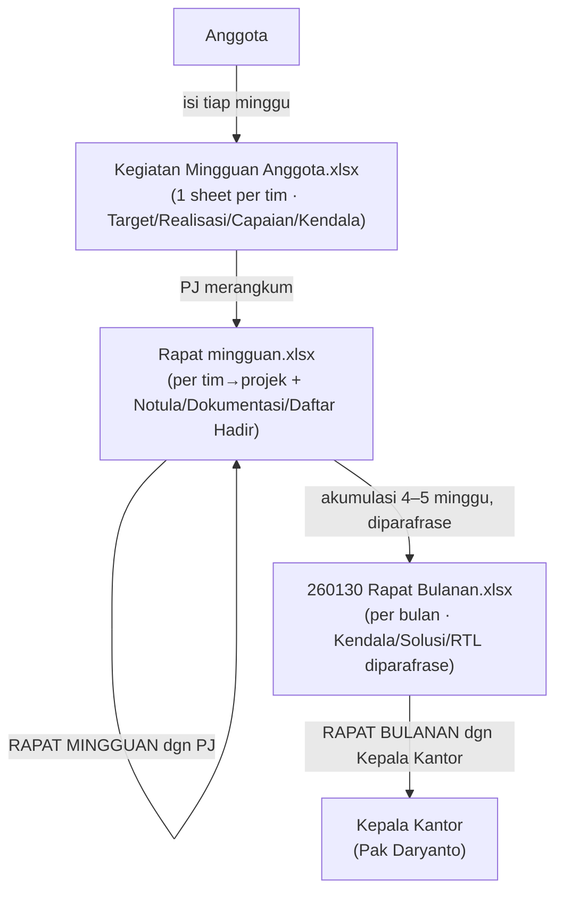
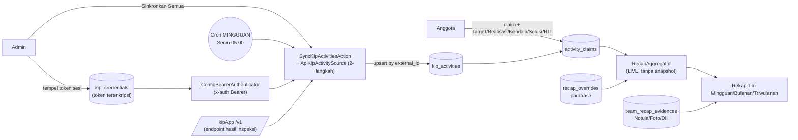

# RFC-002: Kinetik — Keadaan Saat Ini (As-Is) & Alasan Desainnya

| | |
|---|---|
| **Status** | Deskriptif — mendokumentasikan apa yang SUDAH ADA & MENGAPA |
| **Penulis** | Tim Kinetik |
| **Tanggal** | 2026-06-10 |
| **Pelengkap** | [[rfc-001-kinetik]] (usulan awal), [[rfc-003-to-be]] (target), [[actors]] |

> **Tujuan dokumen ini.** RFC-001 adalah *usulan* untuk diskusi. RFC ini berbeda:
> ia memotret **kondisi nyata** sistem hari ini — apa yang sudah berjalan di
> kode, alur manual yang masih dipakai (spreadsheet), dan **mengapa setiap
> keputusan dibuat seperti itu**. Dipakai sebagai titik awal yang jujur sebelum
> kita memutuskan arah di RFC-003.

---

## 1. Ringkasan Keadaan

Saat ini ada **dua dunia yang berjalan paralel**:

1. **Dunia manual (spreadsheet)** — yang *benar-benar dipakai* untuk rapat hari
   ini. Tiga file Excel berantai: Kegiatan Mingguan Anggota → Rapat Mingguan
   (PJ) → Rapat Bulanan (Kepala Kantor).
2. **Dunia aplikasi (Kinetik)** — Laravel + Inertia/Vue yang sudah
   mengimplementasikan sebagian besar Probis item 1–11, menarik data dari
   kipApp dan menggantikan rantai spreadsheet itu secara bertahap.

RFC ini mendokumentasikan keduanya, karena **alasan desain aplikasi hanya masuk
akal kalau kita paham bentuk spreadsheet yang digantikannya.**

---

## 2. Dunia Manual — Spreadsheet yang Dipakai Sekarang

Sumber: `docs/excel.txt` + tiga file `.xlsx` di `docs/`.

### 2.1 Rantai dokumen

> Inilah alur yang **benar-benar dipakai** sekarang dan yang ingin digantikan
> aplikasi. Tiap kotak memetakan ke tabel: `activity_claims` (KMA),
> `team_recap_evidences` + agregasi tim (RM), `recap_overrides` (parafrase RB).

### 2.2 Struktur kolom nyata (yang membentuk skema aplikasi)

**Kegiatan Mingguan Anggota** — satu sheet **per tim** (26 sheet: Umum, Humas,
Keuangan, …, + sheet `Proyek` & `Sheet2`):

| Kolom | Catatan |
|---|---|
| No, Nama Anggota, Projek, Tanggal, Uraian | identitas kegiatan |
| Target, Realisasi, Capaian Kinerja (%) | **Capaian = Realisasi/Target** (rumus) |
| Permasalahan, (Solusi, Rencana Tindak Lanjut) | beberapa sheet (SPIP, SAKIP, PPID) menambah kolom Solusi/RTL + **Jam Mulai/Selesai** + **Link Bukti dukung** |

> Sheet `Sheet2` adalah **matriks anggota × projek** (centang True/False siapa
> mengerjakan projek apa) — inilah cikal-bakal `project_members`.
> Sheet `Proyek` = daftar Tim PJK → Projek.

**Rapat mingguan** — satu sheet per minggu (mis. "Minggu 1 Juni"):

| Kolom | Catatan |
|---|---|
| No, Tim PJK, Projek, Uraian | digabung **per tim, per projek** |
| Target, Realisasi, Capaian (%) | agregasi |
| Permasalahan, Solusi, Rencana Tindak Lanjut | hasil pembahasan |
| **Notula, Dokumentasi, Daftar Hadir** | **bukti rapat** (kolom 9/10/11) |

**Rapat Bulanan** — satu sheet **per bulan** (Januari … Mei 2026). Format sama,
tapi Permasalahan/Solusi/RTL **diparafrase** dan diberi penomoran ("1. … 2. …").
Terlihat juga sel error nyata (`#DIV/0!`, `#VALUE!`) → bukti kelemahan rumus
manual yang ingin dihilangkan aplikasi.

### 2.3 Apa yang "diajarkan" spreadsheet ke aplikasi

- **Hirarki rekap berjenjang**: mingguan (per anggota) → mingguan tim (per
  projek) → bulanan (parafrase) → (triwulanan FRA).
- **Field tetap**: Target, Realisasi, Capaian%, Kendala, Solusi, RTL — persis
  kolom `activity_claims`.
- **Bukti rapat** tiga jenis: Notula / Dokumentasi / Daftar Hadir →
  `team_recap_evidences.type`.
- **Segmentasi per Tim → Projek** sebagai unit tampilan rekap.
- **Parafrase di tingkat bulanan** (bukan menimpa data asli) → `recap_overrides`.

---

## 3. Dunia Aplikasi — Apa yang Sudah Dibangun

Diverifikasi langsung dari kode (`app/`, `routes/web.php`,
`routes/console.php`). Dua domain hidup di satu codebase:

### 3.1 Domain A — Matriks Kinerja (klasik, sudah lama ada)
Master data + pelaporan per butir kerja + persetujuan + dashboard.
Controller: `Team/Employee/Project/PerformancePlan/WorkItem`,
`PerformanceApproval`, `ReportAttachment`, `Dashboard`, `EmployeeReport`,
`Notification`. Role: `admin | head | staff` (Spatie `HasRoles`, kolom
`users.role`).

### 3.1a Arsitektur nyata hari ini

> **Garis putus yang belum ada:** Finalize/snapshot (`recap_documents`), sync
> **struktur**, Pilar B, cron **harian**, refresh token. Lihat §3.3.

### 3.2 Domain B — Kinetik (integrasi kipApp, baru)

| Probis | Implementasi nyata | Status |
|---|---|---|
| 5 — Ekstrak kipApp | `SyncKipActivitiesAction` + `ApiKipActivitySource` (2-langkah: `belumkirim`→`kegiatan?skpid`), `KipIntegrationController::syncAll` (1 token admin) | ✅ |
| 6–8 — Scrapper & Claim | `WeeklyActivityController` (index/sync/storeClaim/storeManualActivity) → `SaveActivityClaimAction` → `activity_claims` | ✅ |
| 9–11 — Rekap berjenjang | `TeamRecapController` (weekly/monthly/quarterly) + `RecapAggregator` + `RecapOverride` (parafrase) + `TeamRecapEvidence` (bukti rapat) | ✅ |

**Sinkronisasi:** `KipCredential` menyimpan **1 token admin terenkripsi**
(`token` cast `encrypted`); `ConfigBearerAuthenticator` memakai token itu, lalu
fallback ke `KIP_TOKEN` env. Cron saat ini **mingguan** (`routes/console.php`:
`weeklyOn(1, '05:00')`), bukan harian.

**Claim flow:** anggota melihat `kip_activities` minggu berjalan, meng-claim ke
`performance_plans` (RK), mengisi Target/Realisasi/Kendala/Solusi/RTL → tersimpan
`activity_claims` (status `draft|saved`). `RecapAggregator` menghitung
**Capaian = Σrealisasi/Σtarget × 100** secara **live** (tanpa snapshot).

### 3.3 Yang BELUM ada di kode (dibanding usulan RFC-001)
- `recap_documents` / Finalize / Promote (rekap masih **live-only**, tak ada
  snapshot dokumen rapat).
- Sinkronisasi **struktur** (Tim/Projek/Anggota Projek) dari kipApp — model
  `project_members` ada, tapi belum ada action sync-nya; struktur masih lewat
  master Domain A.
- Pilar B (analitik beban kerja) — belum ada service/dashboard.
- Cron **harian** + token lifecycle (deteksi expired/refresh).
- SSO realm `pegawai-bps` untuk login Kinetik.

---

## 4. Integrasi kipApp — Keadaan Nyata (diverifikasi live 2026-06-10)

Detail lengkap: [[kipapp-live-capture-2026-06-10]]. Ringkas:

- **Auth = `x-auth: Bearer <JWT>`** (bukan cookie). Token lahir dari SSO
  Keycloak realm `pegawai-bps`, client `03340-kipapp-h0m`, **TTL ~24 jam**.
- **Token admin bisa tarik semua pegawai** by `niplama` (role index `3` =
  admin unit kerja) — inilah dasar sinkronisasi terpusat yang sudah dipakai.
- **kipApp tahu Ketua Tim secara native** (`/v1/user` → `isketuatim`,
  `riwayatketuatim`).
- **Target hidup di teks IKI**, bukan angka; Realisasi = `progres` (0–100%).
- **Endpoint bisa "tidak sinkron"**: `rkpegawai` bisa `0` sementara `belumkirim`
  punya kegiatan → sync harus digerakkan dari `belumkirim`, bukan `rkpegawai`.

### 4.1 Catatan penting tentang cara akuisisi data
Semua endpoint di atas **ditemukan dari inspeksi SPA kipApp** (belum ada
dokumentasi API resmi dari pusat). Token didapat dari **sesi login SSO seorang
admin**, lalu disalin sebagai `KIP_TOKEN`. **Mengapa begini:** kredensial
server-to-server resmi sudah *disetujui* (2026-06-04) tapi **belum diterima**;
sampai itu tiba, token-sesi-admin adalah satu-satunya jembatan yang berfungsi.

---

## 5. Mengapa Desainnya Seperti Ini (Rationale)

| Keputusan saat ini | Mengapa |
|---|---|
| **kipApp tetap tempat input**, Kinetik hanya menarik | Tak boleh mengubah cara kerja kipApp (sistem pusat); pegawai sudah terbiasa input di sana. |
| **1 token admin terpusat** (bukan tiap pegawai login & tarik) | Terbukti admin bisa tarik semua; menghindari memaksa tiap pegawai mengelola token; sinkronisasi bisa jalan tanpa kehadiran semua orang. |
| **Token sesi disimpan, bukan OAuth server** | Kredensial resmi belum ada. `KipAuthenticator` dibuat **swappable** (kontrak 1 method) supaya saat creds resmi tiba, cukup bind implementasi baru tanpa ubah kode lain. |
| **Cron mingguan, bukan harian** | Rapat berbasis mingguan; menarik mingguan "cukup" untuk MVP & meminimalkan risiko token mati antara sync. (Harian = target, lihat RFC-003.) |
| **Rekap live (tanpa snapshot)** | Implementasi tercepat untuk menampilkan rekap; *belum* memenuhi kebutuhan "dokumen rapat yang terkunci" — itu utang yang diakui. |
| **Target/Realisasi diisi manual saat claim** | kipApp tak punya angka target terstruktur (hanya teks IKI + `progres`). Manual = satu-satunya cara dapat angka yang bisa diagregasi. |
| **`capaian` kipApp tidak dipakai sebagai ukuran** | Isian pegawai sering asal (100% semua) → sinyal lemah; karena itu Capaian dihitung ulang dari Target/Realisasi yang di-claim. |
| **Reserved columns (`reserved_1..3`)** di `kip_activities` & `activity_claims` | Probis item 6 minta "siapkan variabel cadangan >2" untuk kebutuhan jam/presisi masa depan. |
| **Portable SQLite/Postgres** (no Postgres-only) | Prod PostgreSQL, lokal/CI SQLite → query/migrasi harus portabel. |

---

## 6. Aktor Saat Ini (ringkas — detail di [[actors]])

| Aktor | Implementasi sekarang | Catatan |
|---|---|---|
| **Admin** | role `admin`; satu-satunya yang bisa simpan token & `syncAll` (`can:manage-kip-integration`) | juga kelola master Domain A |
| **Staff / Anggota** | role `staff`; claim kegiatan, isi rekap mingguan diri | dibuat otomatis saat user ditautkan ke employee |
| **Head / Pimpinan** | role `head`; dashboard lintas tim, laporan pegawai | |
| **PJ / Ketua Tim** | **belum jadi role formal** — disimpulkan dari `teams.leader_id` / `projects.leader_id` / pivot `employee_team.role='leader'` | kipApp punya `isketuatim` (belum dimanfaatkan) |
| **Cron** | scheduler mingguan | token-dependent |
| **kipApp** | sistem eksternal sumber data | |

> **Kesenjangan aktor utama:** "PJ" yang sangat sentral di alur spreadsheet
> (yang merangkum & memegang bukti rapat) **belum punya identitas/izin formal**
> di aplikasi. Ini diangkat di [[actors]] & RFC-003.

---

## 7. Utang & Risiko yang Diketahui (jujur)

1. **Token rapuh** — TTL ~24 jam, tak ada refresh otomatis; cron bisa **gagal
   diam-diam** saat token mati. Belum ada deteksi/alert.
2. **API tidak resmi** — endpoint hasil inspeksi; bisa berubah sewaktu-waktu.
3. **Rekap live-only** — tak ada dokumen final terkunci untuk rapat (kebutuhan
   nyata dari pola spreadsheet).
4. **Struktur belum di-sync** — Tim/Projek/Anggota Projek bisa beda antara
   master Domain A dan kipApp.
5. **Kualitas `capaian`** lemah; Target manual → bergantung kerajinan pengisi.
6. **PJ tanpa izin formal** — aturan "hanya PJ yang upload bukti / finalize"
   belum bisa ditegakkan.
7. **Dua domain (Matriks Kinerja vs Kinetik)** hidup berdampingan — perlu
   kejelasan mana yang jadi sumber kebenaran ke depan.

---

## 8. Apa yang Dipakai Sebagai Dasar RFC-003

RFC-003 (target) akan menjawab utang di §7, dengan keputusan inti:
- **API resmi vs scraping harian** (dua metode yang sedang dibandingkan).
- Promosikan **PJ jadi aktor formal** (sumber: `isketuatim` kipApp).
- **Finalize/Promote** (dokumen rapat) — menutup gap live-only.
- **Sync harian + token lifecycle**.
