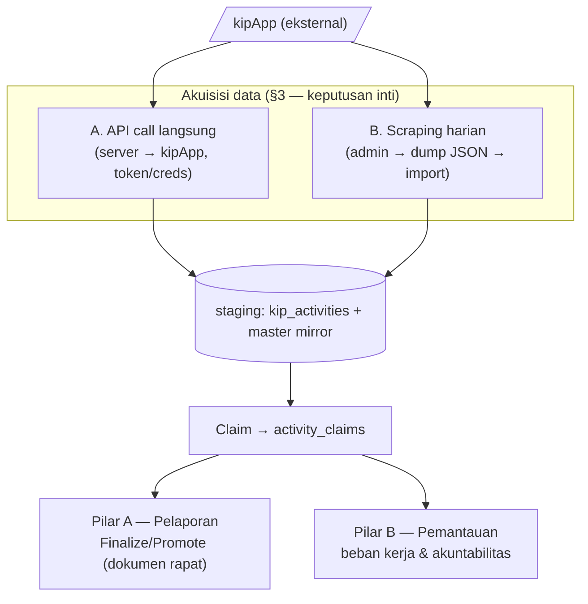
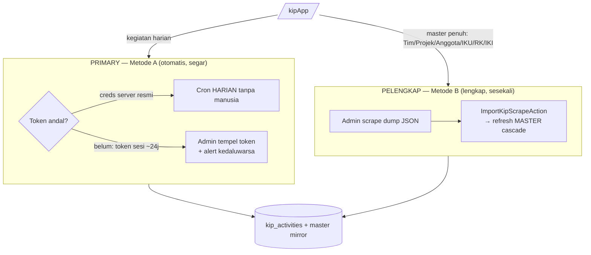

# RFC-003: Kinetik — Target yang Ingin Diimplementasikan (To-Be)

| | |
|---|---|
| **Status** | Usulan arah — untuk disepakati |
| **Penulis** | Tim Kinetik |
| **Tanggal** | 2026-06-10 |
| **Dasar** | [[rfc-002-as-is]] (kondisi nyata), [[rfc-001-kinetik]] (usulan awal), [[kipapp-live-capture-2026-06-10]] (temuan live), [[actors]] |

> **Tujuan.** RFC-002 memotret apa adanya. RFC ini memutuskan **ke mana kita
> menuju** dan menutup utang di RFC-002 §7. Keputusan paling besar — **cara
> mengambil data kipApp** — dibahas tuntas di §3.

---

## 1. Sasaran (Goals)

1. **Akuisisi data kipApp yang andal** — tidak gagal diam-diam, tidak
   bergantung pada satu orang menempel token tiap hari (§3).
2. **Sinkronisasi struktur**, bukan hanya kegiatan — Tim, Projek, Anggota Tim,
   Anggota Projek, dan cascade IKU→RK→IKI ditarik dari kipApp (§4).
3. **Dokumen rapat yang terkunci** — Finalize/Promote menggantikan rekap
   live-only (§5).
4. **PJ sebagai aktor formal** — diturunkan dari kipApp `isketuatim` (§6, [[actors]]).
5. **Pemantauan beban kerja (Pilar B)** — analitik akuntabilitas (§7).

**Non-Goals:** penugasan task ala Jira penuh; fitur penilaian SDM formal
(reserved); mengubah cara kerja kipApp.

---

## 2. Bentuk Akhir (gambaran)

---

## 3. KEPUTUSAN INTI — Cara Mengambil Data kipApp

Kita membandingkan **dua metode** (sesuai arahan): **(A) panggil API langsung**
vs **(B) porting API + scraping manual harian**. Keduanya nyata: A sudah ada di
kode (`ApiKipActivitySource`); B adalah pola di balik `Scapring KipApp.rar`.

### 3.1 Metode A — Panggil API kipApp langsung (server-side)

Server Kinetik memanggil endpoint kipApp memakai `x-auth` token (sekarang token
sesi admin; nanti kredensial server resmi).

**Pro**
- **Real-time / on-demand & otomatis** — cron tarik kapan saja, tanpa manusia.
- **Sudah terbangun** — `ApiKipActivitySource` (2-langkah), upsert idempotent
  by `external_id`, `KipAuthenticator` swappable.
- **Inkremental & murah** — hanya tarik `belumkirim` per pegawai; payload kecil.
- **Satu sumber kebenaran** — data selalu dari API, tak ada salin-tempel.

**Kontra**
- **Token sesi TTL ~24 jam, tanpa refresh** → cron bisa gagal diam-diam.
  *Mitigasi:* kredensial server resmi (sudah disetujui, belum diterima) **atau**
  deteksi-expired + alert + alur re-paste.
- **Endpoint tidak resmi** — bisa berubah; perlu konfirmasi/dok resmi (Pak Hespri).
- **Coupling ke ketersediaan kipApp** saat sync berjalan.

### 3.2 Metode B — Porting API + Scraping manual harian

Admin (login SSO) menjalankan skrip scrape di sesi browser yang mengekspor
**dump JSON lengkap** (seperti rar: `hasil_pegawai`, `proyek`, `tim_kerja`,
`timkerja_anggota`, `iku`/`sasaran`/`tujuan`, `iku_rkkt`, `hasil_rk`, `iki`,
`hasil_periode_skp`, `pelaksanaan`), lalu **mengimpor** ke Kinetik.

**Pro**
- **Bekerja hari ini tanpa creds server** — cukup admin yang sudah login.
- **Snapshot menyeluruh** — sekali jalan menangkap **seluruh cascade**
  (tujuan→sasaran→IKU→RK→IKI→pegawai→proyek→anggota→kegiatan) — ideal untuk
  **seed/refresh master** yang metode A belum lakukan.
- **Tahan perubahan auth** — selama UI bisa dibuka manusia, scrape jalan.
- **Audit-able** — dump JSON tersimpan sebagai artefak.

**Kontra**
- **Manual tiap hari** — bergantung kedisiplinan admin; rawan telat/lupa.
- **Stale** — data setua scrape terakhir.
- **Butuh pipeline impor** (validasi, mapping, dedup) — pekerjaan tambahan.
- **Payload besar** (rar ~5 MB JSON) tiap kali.
- **Rapuh ke perubahan struktur halaman/skrip** scrape.

### 3.3 Perbandingan ringkas

| Dimensi | A — API langsung | B — Scrape manual harian |
|---|---|---|
| Otomatis tanpa manusia | ✅ (jika token/creds hidup) | ❌ butuh admin tiap hari |
| Berfungsi hari ini tanpa creds resmi | 🟡 (token sesi ~24j) | ✅ |
| Cakupan master penuh (cascade) | 🟡 perlu endpoint per entitas | ✅ sekali jalan |
| Kesegaran data | ✅ on-demand | 🟡 setua scrape terakhir |
| Beban operasional harian | rendah | tinggi |
| Kerapuhan | endpoint berubah | UI/skrip berubah + token |
| Sudah ada di kode | ✅ | ❌ (perlu importer) |

### 3.4 Rekomendasi — **Hybrid, condong ke A**

1. **Primary = Metode A.** Pertahankan & keraskan `ApiKipActivitySource` untuk
   **kegiatan harian** (inkremental, otomatis). Begitu **kredensial server
   resmi** tiba → bind `KipAuthenticator` baru (OAuth2 client-credentials),
   aktifkan **cron harian** tanpa campur tangan.
2. **Jembatan sampai creds resmi** = token admin yang ditempel (sudah ada) +
   **deteksi token kedaluwarsa + alert + alur re-paste**.
3. **Metode B sebagai pelengkap, bukan rutinitas harian** — jadikan
   **importer master** (Tim/Projek/Anggota/IKU/RK/IKI) dari dump JSON, dipakai
   untuk **seed awal & refresh berkala** struktur yang belum di-sync API
   (§4). Jadi B menutup celah cakupan, A menutup celah kesegaran.

> **Intinya:** jangan pilih salah satu. **A untuk kegiatan harian (otomatis,
> segar); B untuk master cascade (lengkap, sesekali).** Hindari ketergantungan
> pada scrape manual *harian* sebagai jalur utama — itu memindahkan kerapuhan ke
> manusia.

> **A** menjaga **kesegaran kegiatan harian**; **B** menjaga **kelengkapan master**.
> Scrape manual **bukan** jalur harian utama — itu memindahkan kerapuhan ke manusia.

### 3.5 Pekerjaan yang dihasilkan keputusan ini
- `KipStructureSource` + `SyncKipStructureAction` (Tim/Projek/Anggota Projek via
  `proyek?timkerjaid`, `proyek/anggota?proyekid`, `timkerja/anggota?id`).
- `ImportKipScrapeAction` (parser dump JSON → master mirror) — Metode B.
- `TokenStatus` service: deteksi `expires_at`, badge di UI integrasi, alert.
- OAuth2 `KipAuthenticator` (stub) untuk creds resmi.
- Cron: dari `weeklyOn(Monday)` → **harian** (begitu token andal).

---

## 4. Sinkronisasi Struktur (menutup gap RFC-002 §3.3)

Tarik dari kipApp (jangan input manual — bisa beda):
- **Tim** (`/v1/dashboard/rktimkerja`, `/v1/timkerja/anggota?id`), **Ketua**
  (`niplamaketua`), **Anggota Tim**, **Anggota Projek** (`/v1/proyek/anggota`).
- **Cascade IKU→RK→IKI** (`/v1/skp/rk`, `/v1/skp/iki`) — termasuk **target inline
  di teks IKI** untuk diparse/ditawarkan saat claim.

Pemetaan ke model existing: `teams`, `employee_team`, `projects`,
`project_members`, `performance_indicators`, `performance_plans` (RK),
`work_items`. Kunci pegawai = `nip_lama` (niplama).

---

## 5. Pilar A — Dokumen Rapat (menutup gap live-only)

Tambah **`recap_documents`** + `FinalizeRecapAction` + `PromoteRecapAction`:
- **Finalize** (oleh PJ) → snapshot agregasi + parafrase **terkunci** (status
  `final`).
- **Promote** → mingguan→bulanan→triwulanan (FRA), PJ memparafrase ringkasan
  bulanan.
- **Bukti rapat** (Notula/Dokumentasi/Daftar Hadir) — batasi upload ke **PJ**;
  opsi wajib sebelum finalize.

Model hybrid: live sebelum final (sudah ada `RecapAggregator`), snapshot saat
final. Tabel `recap_overrides` & `team_recap_evidences` dipakai ulang.

---

## 6. PJ sebagai Aktor Formal (temuan live)

`/v1/user` mengembalikan **`isketuatim`** + **`riwayatketuatim`** → kipApp tahu
siapa Ketua Tim. **To-be:** turunkan peran **PJ** dari sinyal ini saat sync
(set `employee_team.role='leader'` / `teams.leader_id`), bukan dari input manual.
Izin PJ (finalize, parafrase, upload bukti, lihat beban anggota tim) ditegakkan
lewat policy. Detail kapabilitas per aktor: [[actors]].

---

## 7. Pilar B — Pemantauan Beban Kerja & Akuntabilitas

`WorkloadAnalyticsService` + dashboard berjenjang (Kantor→Tim→Anggota):
- Metrik: Coverage, Gap days, Volume, Jam kerja, Capaian, Recency, Ketepatan
  kirim (`tanggal` vs `tanggalkirim`), Kelengkapan bukti.
- **Indeks Beban** ternormalisasi (100 = rata-rata tim); bobot kompleksitas
  (`performance_plans.complexity_weight`, default 1).
- Cache `workload_snapshots` (opsional) untuk performa & tren.
- **Hati-hati:** `capaian` kipApp lemah (sering 100% asal) — jangan jadikan
  ukuran utama; sandarkan pada keteraturan (coverage/gap/recency).

---

## 8. Hal yang Perlu Diputuskan Pimpinan / Dikonfirmasi

1. **Akuisisi data:** setujui **Hybrid (A primary + B importer master)**? (§3.4)
2. **Kredensial server resmi** — dorong realisasinya ke pusat (Pak Hespri);
   sampai itu, terima token-sesi-admin + alert sebagai jembatan.
3. **Frekuensi sync:** harian (begitu token andal)?
4. **Finalize:** dilakukan PJ **sebelum** atau **saat** rapat? Promote
   otomatis atau perlu persetujuan?
5. **Bukti rapat:** hanya PJ? wajib sebelum finalize? terbawa ke bulanan?
6. **Pilar B:** ambang status Aktif/Perlu Perhatian/Tidak Aktif; dimensi & bobot
   beban; sumber bobot kompleksitas; perhitungan hari kerja (libur/cuti).
7. **Target/Realisasi:** parse dari teks IKI, manual, atau default dari target RK?
8. **SSO realm `pegawai-bps`** untuk login Kinetik — digabung atau trek terpisah?
9. **Sumber kebenaran:** apakah Kinetik (Domain B) menggantikan Matriks Kinerja
   klasik (Domain A), atau keduanya tetap hidup berdampingan?

---

## 9. Rollout

| Tahap | Akuisisi & Struktur | Pilar A | Pilar B |
|---|---|---|---|
| **M1 (MVP)** | A diperkeras + token alert; importer master (B); sync **harian** | Finalize+snapshot **mingguan** | Dashboard **Tim** (coverage + indeks + status) |
| **M2** | OAuth2 creds resmi; robustness/retry/log | Promote→bulanan + UI bulanan | Dashboard **Kantor** + pemerataan + tren |
| **M3** | — | Triwulanan FRA + persetujuan | Bobot kompleksitas + ketepatan kirim + profil anggota |

> Selaras dengan [[linear-delivery-plan]] (label: `integrasi`, `pilar-a`,
> `pilar-b`, `infra`, `spike`).
