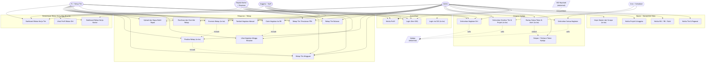
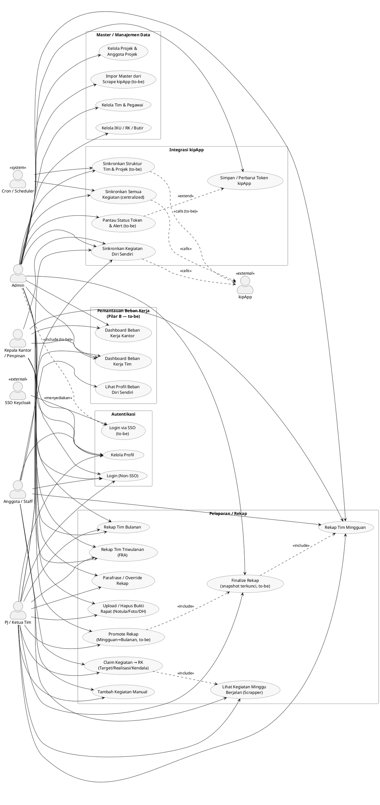

# Use-Case Diagram — Sistem Kinetik

| | |
|---|---|
| **Status** | Dokumentasi |
| **Tanggal** | 2026-06-11 |
| **Dasar** | [[rfc-002-as-is]], [[rfc-003-to-be]], [[actors]], [[proses-bisnis]] |

> Dokumen ini merangkum **seluruh use case Kinetik** — mencakup kondisi saat ini
> (As-Is) dan target (To-Be) — dalam bentuk diagram dan tabel spesifikasi.
> Digunakan sebagai acuan bersama antara tim teknis dan pimpinan dalam menentukan
> prioritas pengembangan.

---

## 1. Daftar Aktor

| Aktor | Jenis | Keterangan |
|---|---|---|
| **Admin** | Manusia (internal) | Pengelola aplikasi & integrasi; satu-satunya pemegang token kipApp dan akses sinkronisasi terpusat |
| **Kepala Kantor / Pimpinan** | Manusia (internal) | Pejabat penilai; memantau rekap lintas tim dan kantor |
| **PJ / Ketua Tim** | Manusia (internal) | Penanggung jawab tim; diturunkan dari `isketuatim` kipApp; pemegang izin finalize, bukti rapat, dan parafrase |
| **Anggota / Staff** | Manusia (internal) | Pegawai pelaksana; claim kegiatan dan isi rekap mingguan diri |
| **Cron / Scheduler** | Sistem (internal) | Menjalankan sinkronisasi otomatis berkala (mingguan → target harian) |
| **kipApp** | Sistem eksternal | Sumber kebenaran kegiatan harian, struktur tim, dan sinyal Ketua Tim |
| **SSO Keycloak** | Sistem eksternal | Penyedia autentikasi realm `pegawai-bps`; saat ini dipakai oleh kipApp; target: juga untuk login Kinetik |

---

## 2. Diagram Use Case

### 2.1 PlantUML (source)

### 2.2 Mermaid (fallback)

```mermaid
flowchart TB
  %% ── Aktor ────────────────────────────────────────────
  ADM(["Admin"])
  HEAD(["Kepala Kantor\n/ Pimpinan"])
  PJ(["PJ / Ketua Tim"])
  STAFF(["Anggota / Staff"])
  CRON{{"Cron / Scheduler"}}
  KIP[/"kipApp\n(eksternal)"/]
  SSO[/"SSO Keycloak\n(eksternal)"/]

  %% ── Autentikasi ──────────────────────────────────────
  subgraph AUTH["Autentikasi"]
    UC_LOGIN["Login (Non-SSO)"]
    UC_SSO["Login via SSO *(to-be)*"]
    UC_PROFIL["Kelola Profil"]
  end

  %% ── Master / Manajemen Data ──────────────────────────
  subgraph MASTER["Master / Manajemen Data"]
    UC_TIM["Kelola Tim & Pegawai"]
    UC_IKU["Kelola IKU / RK / Butir"]
    UC_PROJ["Kelola Projek & Anggota"]
    UC_IMPOR["Impor Master dari Scrape *(to-be)*"]
  end

  %% ── Integrasi kipApp ─────────────────────────────────
  subgraph INTEG["Integrasi kipApp"]
    UC_TOKEN["Simpan / Perbarui Token kipApp"]
    UC_TOKEN_ST["Pantau Status Token & Alert *(to-be)*"]
    UC_SYNC_ALL["Sinkronkan Semua Kegiatan"]
    UC_SYNC_SELF["Sinkronkan Kegiatan Diri"]
    UC_SYNC_STR["Sinkronkan Struktur Tim & Projek *(to-be)*"]
  end

  %% ── Pelaporan / Rekap ────────────────────────────────
  subgraph REKAP["Pelaporan / Rekap"]
    UC_SCRAP["Lihat Kegiatan Minggu Berjalan"]
    UC_CLAIM["Claim Kegiatan → RK"]
    UC_MANUAL["Tambah Kegiatan Manual"]
    UC_REKAP_W["Rekap Tim Mingguan"]
    UC_REKAP_M["Rekap Tim Bulanan"]
    UC_REKAP_Q["Rekap Tim Triwulanan (FRA)"]
    UC_FINAL["Finalize Rekap *(to-be)*"]
    UC_PROMOTE["Promote Rekap *(to-be)*"]
    UC_PARAF["Parafrase / Override Rekap"]
    UC_BUKTI["Upload / Hapus Bukti Rapat"]
  end

  %% ── Pemantauan Pilar B ───────────────────────────────
  subgraph PILARB["Pemantauan Beban Kerja (Pilar B — to-be)"]
    UC_DASH_TIM["Dashboard Beban Kerja Tim"]
    UC_DASH_KTR["Dashboard Beban Kerja Kantor"]
    UC_DASH_SELF["Lihat Profil Beban Diri"]
  end

  %% ── Koneksi Aktor → Use Case ─────────────────────────
  ADM --> UC_LOGIN & UC_PROFIL
  HEAD --> UC_LOGIN & UC_PROFIL
  PJ --> UC_LOGIN & UC_PROFIL
  STAFF --> UC_LOGIN & UC_PROFIL
  SSO -.->|menyediakan| UC_SSO

  ADM --> UC_TIM & UC_IKU & UC_PROJ & UC_IMPOR

  ADM --> UC_TOKEN & UC_TOKEN_ST & UC_SYNC_ALL & UC_SYNC_SELF & UC_SYNC_STR
  HEAD --> UC_SYNC_SELF
  PJ --> UC_SYNC_SELF
  STAFF --> UC_SYNC_SELF
  CRON --> UC_SYNC_ALL & UC_SYNC_STR
  UC_SYNC_ALL & UC_SYNC_SELF & UC_SYNC_STR -.->|calls| KIP
  UC_TOKEN_ST -.->|extend| UC_TOKEN

  STAFF --> UC_SCRAP & UC_CLAIM & UC_MANUAL
  PJ --> UC_SCRAP & UC_CLAIM & UC_MANUAL
  ADM & HEAD & PJ & STAFF --> UC_REKAP_W
  ADM & HEAD & PJ --> UC_REKAP_M & UC_REKAP_Q
  PJ & ADM --> UC_FINAL & UC_PROMOTE & UC_PARAF & UC_BUKTI
  UC_CLAIM -.->|include| UC_SCRAP
  UC_FINAL -.->|include| UC_REKAP_W
  UC_PROMOTE -.->|include| UC_FINAL

  ADM & HEAD --> UC_DASH_KTR & UC_DASH_TIM
  PJ --> UC_DASH_TIM
  STAFF --> UC_DASH_SELF
```

---

## 3. Tabel Spesifikasi Use Case

| Use Case | Aktor Utama | Deskripsi Singkat | Prakondisi |
|---|---|---|---|
| **Login (Non-SSO)** | Semua | Masuk ke Kinetik dengan email & password lokal | Akun aktif terdaftar |
| **Login via SSO *(to-be)*** | Semua | Masuk menggunakan SSO Keycloak realm `pegawai-bps` | Integrasi SSO aktif; akun terdaftar di realm |
| **Kelola Profil** | Semua | Melihat dan memperbarui profil dan pengaturan pribadi | Sudah login |
| **Kelola Tim & Pegawai** | Admin | Menambah/ubah/hapus tim, data pegawai, mutasi, pendidikan | Login sebagai Admin |
| **Kelola IKU / RK / Butir** | Admin | Mengelola Indikator Kinerja Utama, Rencana Kerja, dan butir kerja | Login sebagai Admin |
| **Kelola Projek & Anggota Projek** | Admin | Mengelola projek dan keanggotaan projek | Login sebagai Admin |
| **Impor Master dari Scrape *(to-be)*** | Admin | Mengimpor master data (Tim/Projek/IKU/RK/IKI) dari dump JSON hasil scrape kipApp | Login sebagai Admin; dump JSON tersedia |
| **Simpan / Perbarui Token kipApp** | Admin | Menempelkan token sesi kipApp yang baru ke sistem | Login sebagai Admin; token sesi kipApp valid |
| **Pantau Status Token & Alert *(to-be)*** | Admin | Melihat status kedaluwarsa token; menerima alert dan memperbarui token | Login sebagai Admin; token tersimpan |
| **Sinkronkan Semua Kegiatan** | Admin, Cron | Menarik kegiatan semua pegawai aktif dari kipApp menggunakan token admin terpusat | Token kipApp aktif; pegawai ber-`nip_lama` terdaftar |
| **Sinkronkan Kegiatan Diri** | Semua | Menarik kegiatan milik pengguna yang sedang login dari kipApp | Login; akun ditautkan ke employee ber-`nip_lama` |
| **Sinkronkan Struktur Tim & Projek *(to-be)*** | Admin, Cron | Menarik dan memperbarui Tim, Anggota Tim, Projek, Anggota Projek dari kipApp | Token kipApp aktif; endpoint struktur kipApp tersedia |
| **Lihat Kegiatan Minggu Berjalan** | Anggota, PJ | Melihat daftar kegiatan dari `kip_activities` minggu berjalan yang belum di-claim | Sudah login; kegiatan sudah di-sinkronkan |
| **Claim Kegiatan → RK** | Anggota, PJ | Mengaitkan kegiatan ke Rencana Kerja dan mengisi Target, Realisasi, Kendala, Solusi, RTL | Kegiatan tersedia di `kip_activities`; RK aktif tersedia |
| **Tambah Kegiatan Manual** | Anggota, PJ | Menambahkan kegiatan yang tidak tercatat di kipApp | Sudah login; memiliki RK aktif |
| **Rekap Tim Mingguan** | Semua | Melihat agregasi kegiatan dan capaian tim per minggu | Kegiatan diklaim; rekap tersedia |
| **Rekap Tim Bulanan** | Admin, Kepala, PJ | Melihat agregasi bulanan per tim dan projek | Rekap mingguan tersedia |
| **Rekap Tim Triwulanan (FRA)** | Admin, Kepala, PJ | Melihat rekap triwulanan (Evaluasi Capaian Rencana Aksi) | Rekap bulanan tersedia |
| **Finalize Rekap *(to-be)*** | PJ, Admin | Mengunci rekap mingguan menjadi snapshot dokumen rapat yang tidak dapat diubah | PJ; rekap mingguan lengkap; bukti rapat diunggah |
| **Promote Rekap *(to-be)*** | PJ, Admin | Menaikkan rekap mingguan final menjadi rekap bulanan | Rekap mingguan sudah di-finalize |
| **Parafrase / Override Rekap** | PJ, Admin | Mengedit teks Kendala/Solusi/RTL di rekap (tanpa mengubah data asli klaim) | Login sebagai PJ atau Admin; rekap tersedia |
| **Upload / Hapus Bukti Rapat** | PJ, Admin | Mengunggah atau menghapus Notula, Dokumentasi (foto), atau Daftar Hadir rapat | Login sebagai PJ atau Admin; rekap mingguan tersedia |
| **Dashboard Beban Kerja Tim *(to-be)*** | Admin, Kepala, PJ | Melihat metrik beban kerja anggota dalam tim (coverage, gap, volume, capaian, recency) | Login; data kegiatan tersedia; analytics service aktif |
| **Dashboard Beban Kerja Kantor *(to-be)*** | Admin, Kepala | Melihat metrik beban kerja lintas tim di tingkat kantor; ranking tim; pemerataan beban | Login sebagai Admin atau Kepala; Pilar B aktif |
| **Lihat Profil Beban Diri *(to-be)*** | Anggota | Melihat ringkasan beban dan akuntabilitas diri sendiri | Login sebagai Anggota; Pilar B aktif |

---

## 4. Ringkasan Scoping Aktor (As-Is vs To-Be)

| Kapabilitas | Admin | Kepala | PJ / Ketua Tim | Anggota / Staff | Cron | Catatan |
|---|:--:|:--:|:--:|:--:|:--:|---|
| Simpan token + Sinkronkan Semua | ✅ | — | — | — | ✅ (terpicu) | As-Is |
| Sinkronkan kegiatan diri | ✅ | ✅ | ✅ | ✅ | — | As-Is |
| Claim kegiatan → RK | — | — | ✅ | ✅ | — | As-Is |
| Parafrase rekap (overrides) | ✅ | — | ✅ | — | — | As-Is |
| Upload bukti rapat | ✅ | — | ✅ *(eksklusif, to-be)* | — | — | To-Be: hanya PJ |
| Finalize rekap *(to-be)* | ✅ | — | ✅ | — | — | To-Be |
| Promote rekap *(to-be)* | ✅ | — | ✅ | — | — | To-Be |
| Lihat rekap tim | ✅ | ✅ | ✅ (timnya) | ✅ (dirinya) | — | As-Is |
| Lihat rekap lintas tim | ✅ | ✅ | — | — | — | As-Is |
| Dashboard beban tim *(to-be)* | ✅ | ✅ | ✅ (timnya) | — | — | To-Be: Pilar B |
| Dashboard beban kantor *(to-be)* | ✅ | ✅ | — | — | — | To-Be: Pilar B |
| Profil beban diri *(to-be)* | — | — | — | ✅ | — | To-Be: Pilar B |
| Kelola master (Tim/IKU/Projek/RK) | ✅ | — | — | — | — | As-Is |
| Impor master dari scrape *(to-be)* | ✅ | — | — | — | — | To-Be |
| Sinkronkan struktur *(to-be)* | ✅ | — | — | — | ✅ (terpicu) | To-Be |

> ✅ = memiliki izin; — = tidak. Baris bertanda *(to-be)* belum ada di kode hari ini.
